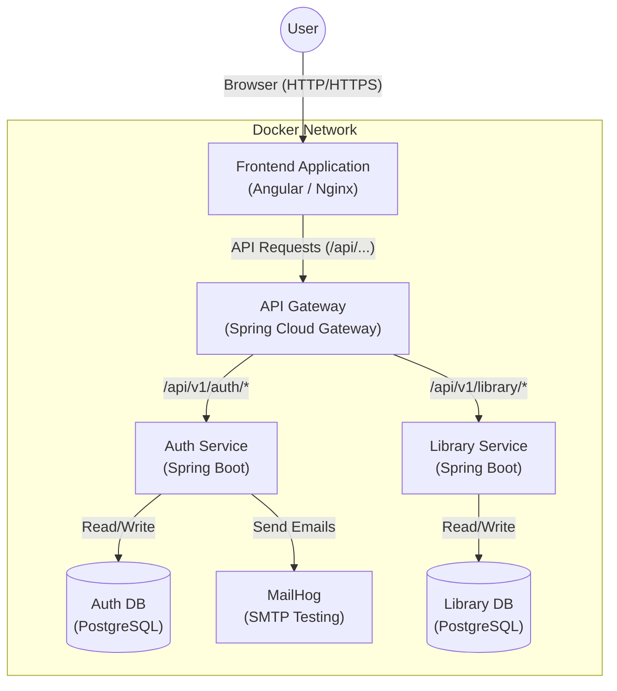
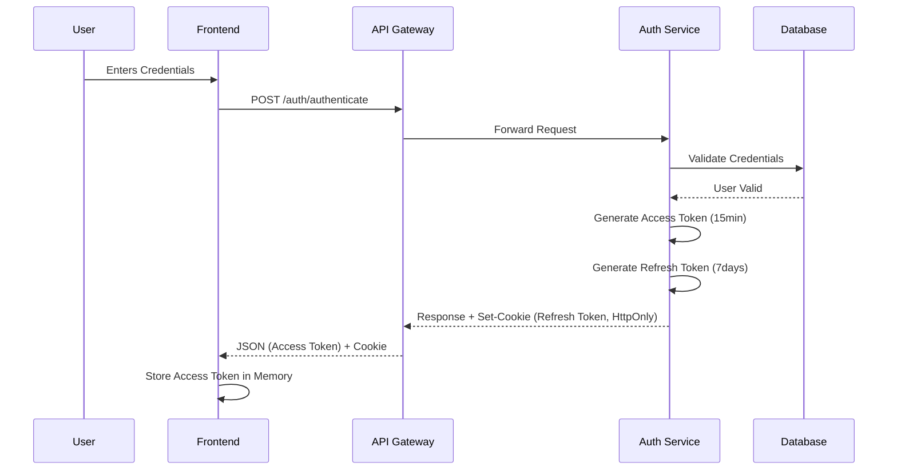
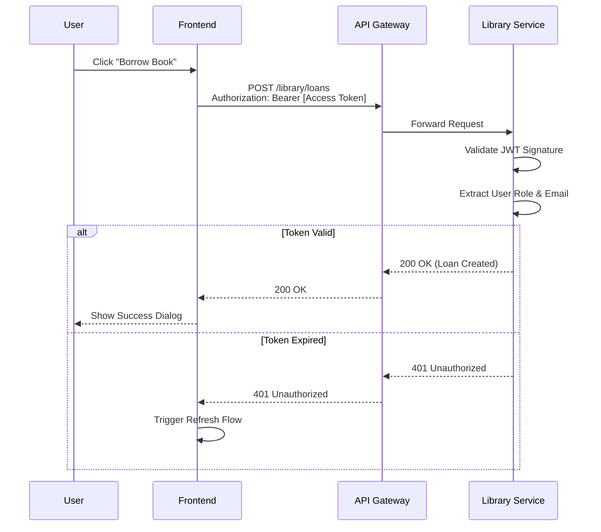

# System Architecture & Authentication Flow

This document provides a visual and technical overview of the Library Application's architecture, including container interactions and the secure JWT authentication flow.

## 1. Container Architecture (Docker Compose)

The application is composed of several Docker containers that interact within a private network. The **API Gateway** acts as the single entry point for the Frontend.

### Key Components:
*   **Frontend**: Serves the Angular application.
*   **API Gateway**: Routes requests to appropriate microservices. Handles CORS and centralizes routing.
*   **Auth Service**: Manages user registration, login, and token issuance (JWT).
*   **Library Service**: Manages books and loans. Protected by JWT validation.
*   **Databases**: Dedicated PostgreSQL instances for isolation.

---

## 2. JWT Authentication Flow

The application uses a **stateless** authentication mechanism with **HttpOnly Cookies** for maximum security.

### Login & Token Issuance

### Accessing Protected Resources (e.g., Borrowing a Book)

---

## 3. API Endpoints Overview

### Auth Service (`/api/v1/auth`)

| Method | Endpoint | Description | Auth Required |
| :--- | :--- | :--- | :--- |
| `POST` | `/register` | Register a new user | No |
| `POST` | `/authenticate` | Login and receive tokens | No |
| `POST` | `/refresh-token` | Get new access token using cookie | No (Cookie req) |
| `POST` | `/forgot-password` | Request password reset email | No |

### Library Service (`/api/v1/books`, `/api/v1/loans`)

| Method | Endpoint | Description | Auth Required |
| :--- | :--- | :--- | :--- |
| `GET` | `/books` | List paginated books | Yes |
| `GET` | `/books/{id}` | Get book details | Yes |
| `POST` | `/loans` | Borrow a book | Yes |
| `GET` | `/loans` | Get current user's loans | Yes |
| `POST` | `/loans/{id}/return` | Return a book (Admin/User) | Yes |

---

## 4. Key Security Features implemented

1.  **HttpOnly Cookies**: The Refresh Token is stored in a cookie that JavaScript cannot access, preventing XSS attacks from stealing the long-lived token.
2.  **Short-lived Access Tokens**: The Access Token (used for API calls) expires quickly (e.g., 15 mins), minimizing the window of opportunity if stolen.
3.  **Role-Based Access Control (RBAC)**: The JWT contains the user's role (`ADMIN` or `USER`), allowing the backend to enforce permissions securely.
